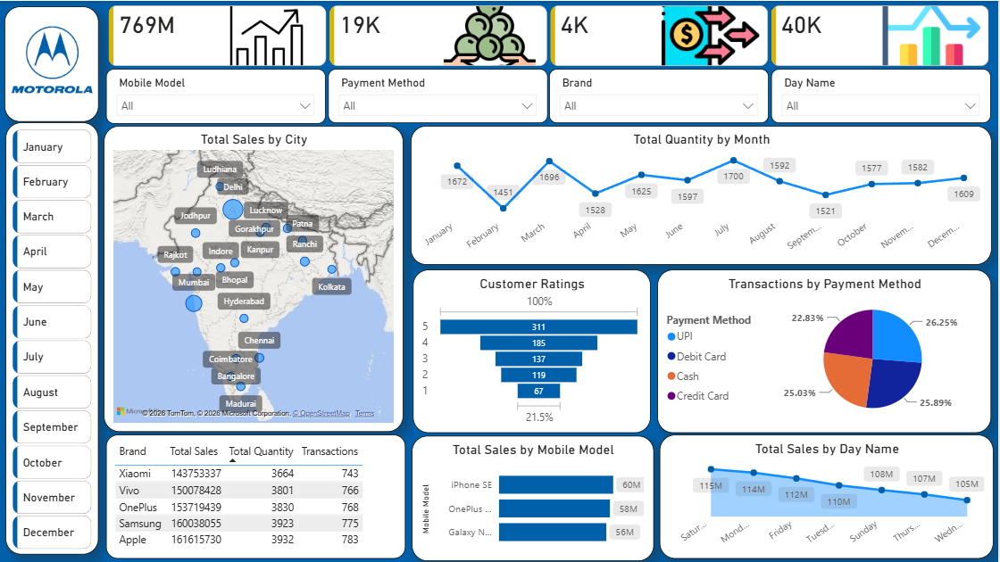

# 📱 Mobile Sales Analysis Dashboard

An interactive **Mobile Sales Analysis Dashboard** built using **Microsoft Power BI** to analyze sales performance, product trends, customer ratings, transactions, and payment methods.



---

## 📊 Project Overview

This project analyzes mobile sales transaction data and converts it into an interactive Power BI dashboard.

The dashboard provides a clear view of:

- Overall sales performance
- Sales by city and brand
- Mobile model performance
- Monthly quantity trends
- Customer ratings
- Payment method distribution
- Day-wise sales performance
- Transaction and quantity metrics

The dashboard also includes interactive filters that allow users to explore the data by **Mobile Model, Payment Method, Brand, Day Name, and Month**.

---

## 🎯 Objectives

The main objectives of this project are to:

- Analyze overall mobile sales performance
- Identify top-performing brands and mobile models
- Understand sales trends across months and days
- Analyze customer rating distribution
- Compare different payment methods
- Understand city-wise sales performance
- Build an interactive and easy-to-use business dashboard

---

## 🛠️ Tools & Technologies

- **Microsoft Power BI** – Dashboard development and visualization
- **Power Query** – Data cleaning and transformation
- **DAX** – Measures and calculations
- **Microsoft Excel** – Source dataset

---

## 📁 Dataset

The dataset contains mobile sales transaction information, including fields such as:

- Transaction ID
- Date
- Brand
- Mobile Model
- Units Sold
- Price Per Unit
- Customer Name
- Customer Age
- City
- Payment Method
- Customer Rating

The dataset contains approximately **3.8K transactions across 14 columns**.

> **Note:** The dataset is used for portfolio/learning purposes.

---

## 📌 Dashboard Components

### KPI Cards
- Total Sales
- Total Quantity
- Total Transactions
- Additional sales metric

### Visualizations
- **Total Sales by City** – Geographic view of sales performance
- **Total Quantity by Month** – Monthly quantity trend
- **Customer Ratings** – Distribution of customer ratings
- **Transactions by Payment Method** – Payment method comparison
- **Brand Performance Table** – Sales, quantity, and transactions by brand
- **Total Sales by Mobile Model** – Comparison of top mobile models
- **Total Sales by Day Name** – Day-wise sales trend

### Interactive Filters
- Mobile Model
- Payment Method
- Brand
- Day Name
- Month

---

## 💡 Key Insights

Some of the observations available from the dashboard include:

- **Apple** records the highest total sales among the brands shown in the dashboard.
- **Apple** also has the highest quantity sold among the listed brands.
- **UPI** is the most commonly used payment method in the displayed transaction distribution.
- **5-star ratings** have the highest number of customer responses.
- Sales performance varies across different cities, months, and days.
- Mobile model performance differs significantly across the product portfolio.

---

## 📂 Project Structure

```text
Mobile-Sales-Analysis/
│
├── README.md
├── Mobile Sales project.pbix
├── Mobile Sales Data.xlsx
└── Dashboard.png
```

---

## 🚀 How to Use

1. Download or clone this repository.
2. Open `Mobile Sales project.pbix` using **Microsoft Power BI Desktop**.
3. If required, update the dataset path in Power Query.
4. Refresh the data.
5. Use the dashboard filters to explore different sales dimensions.

---

## 📷 Dashboard Preview

The dashboard is designed as a single-page interactive report with KPI cards, charts, tables, geographic analysis, and slicers for filtering the data.

---

## 📈 Skills Demonstrated

This project demonstrates practical skills in:

- Data Cleaning
- Data Transformation
- Data Visualization
- Power BI Dashboard Development
- DAX
- Business Intelligence
- Exploratory Data Analysis
- KPI Reporting
- Interactive Dashboard Design

---

## 👤 Author

Shubham Talekar

BSc Computer Science | Aspiring Data Analyst

---

⭐ If you find this project useful, feel free to explore the dashboard and the project files.
